# VoiceNexus AI — Technical Architecture Blueprint

**Status:** Proposed greenfield architecture  
**Document type:** Technical blueprint; no implementation code  
**Prepared:** 20 June 2026  
**Decision horizon:** MVP through multi-region growth

## 1. Executive summary

VoiceNexus AI should be built as a multi-tenant communications control plane with channel-specific real-time data planes. The platform owns customer identity, consent, workflows, memory, audit history, billing usage, and agent configuration. Twilio owns carrier connectivity and channel delivery. LLM, speech, CRM, and analytics vendors sit behind replaceable adapters.

The recommended first production architecture is a **modular service platform deployed as six units**, not a large fleet of microservices:

1. Web applications: admin console and human-agent workspace.
2. Control API: tenant configuration, contacts, agents, campaigns, integrations, and reporting APIs.
3. Communications gateway: Twilio webhooks, REST callbacks, channel normalization, and delivery commands.
4. Real-time voice gateway: ConversationRelay WebSockets, session orchestration, LLM streaming, tools, and handoff.
5. Workflow workers: campaigns, follow-ups, lead qualification, retries, compliance gates, memory extraction, and asynchronous processing.
6. Scheduler/Temporal workers: durable timers and long-running state machines.

Use PostgreSQL as the transactional system of record, Redis for ephemeral session/rate-limit state, object storage for recordings and artifacts, a durable queue/event bus for asynchronous work, and pgvector initially for semantic memory and knowledge retrieval. Add ClickHouse or an equivalent analytical store when reporting volume justifies it.

The preferred voice path is **Twilio ConversationRelay** because managed speech recognition and synthesis shorten time to market. Keep a separate Media Streams adapter as a future option for use cases that need raw audio or custom speech models; the two modes cannot be mixed on one call. Human handoff, provider fallback, recording consent, and WebSocket failure handling must be designed into the first voice release.

The first-party VoiceNexus memory store is authoritative. Twilio Conversation Memory may be enabled as an optional tenant-scoped integration, but it must not be the sole store because portability, retention, tenant count, subject deletion, and cross-channel governance belong to VoiceNexus.

## 2. Scope and explicit assumptions

### 2.1 Product scope

The blueprint supports:

- Inbound and outbound AI voice calls.
- Inbound and outbound WhatsApp conversations.
- Contact and lead management.
- Agent configuration, prompt versioning, tools, knowledge, and evaluation.
- Campaigns, qualification, follow-ups, appointments, and reminders.
- Human escalation into a unified agent inbox or an external contact center.
- Persistent customer context across channels and sessions.
- Multi-tenant administration, roles, metering, audit, and billing integration.
- Tenant-managed CRM and webhook integrations.

### 2.2 Assumptions that must remain configurable

- Twilio is the initial telephony and WhatsApp provider, but provider IDs never become VoiceNexus primary keys.
- ConversationRelay is the default voice transport. Media Streams is a distinct advanced transport.
- A streaming text LLM is the initial reasoning engine. The LLM provider is selected per tenant/agent through the model gateway.
- PostgreSQL is authoritative for operational data.
- The default deployment is AWS, single region and multi-AZ at launch, with a planned multi-region voice data plane.
- The default tenancy tier is a shared application and shared database with PostgreSQL row-level security. Dedicated databases and regions are enterprise options.
- Each production tenant normally receives a Twilio subaccount; enterprise tenants may bring their own Twilio account. A pooled account is acceptable only for sandbox/trial traffic.
- Regulations vary by tenant, use case, destination, and recipient. Compliance policies are data-driven gates, not hard-coded assumptions.

### 2.3 Non-goals for the first release

- Building a carrier network or proprietary global PSTN layer.
- Training foundation models.
- Full workforce management, payroll, or enterprise CRM replacement.
- Arbitrary user-authored code inside agent tools.
- Payment card collection through an LLM.
- Active-active multi-region writes on day one.

## 3. Architecture principles

1. **VoiceNexus is the system of record.** Providers are delivery systems and may be replaced.
2. **Tenant context is mandatory.** Every request, event, cache key, object, vector, log, and job is tenant-scoped.
3. **Compliance precedes dispatch.** No call or message reaches a provider before consent, quiet-hours, suppression, destination, frequency, and policy checks pass.
4. **External events are untrusted and repeatable.** Verify signatures, preserve raw envelopes, deduplicate, and process asynchronously.
5. **Realtime and transactional paths are separate.** The voice loop stays lean; reporting, extraction, CRM sync, and billing run asynchronously.
6. **At-least-once delivery is assumed.** Consumers are idempotent; the database outbox prevents dual-write loss.
7. **AI output is a proposal, not authority.** Deterministic policy and tool gateways decide what actions are permitted.
8. **Memory is provenance-aware.** Verified facts, user statements, model inferences, and summaries are not treated as equally reliable.
9. **Version everything used in a conversation.** Agent, prompt, model policy, knowledge snapshot, workflow, compliance policy, and template versions are attached to the interaction.
10. **Start operationally simple.** Logical service boundaries are strict, while initial deployment units remain few.

## 4. Complete system architecture

### 4.1 System context

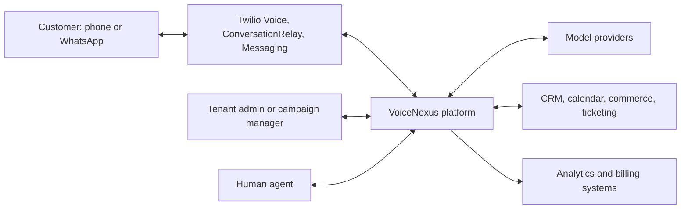

### 4.2 Logical architecture

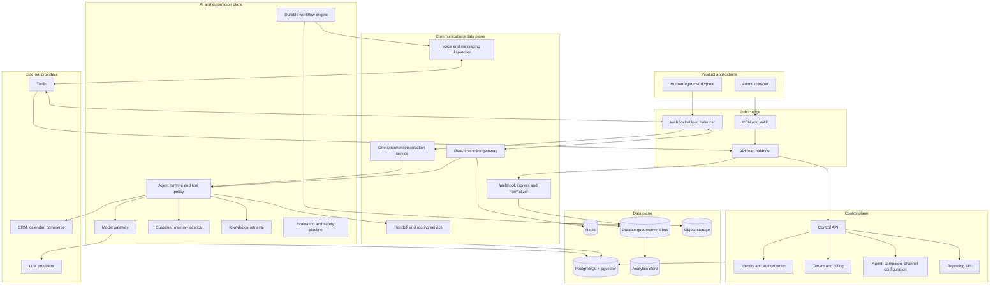

### 4.3 Control plane versus data plane

**Control plane** operations are comparatively low-volume and strongly consistent: tenant setup, users, permissions, contact imports, channel configuration, agent version publication, campaign definition, templates, integrations, billing plans, and reports.

**Data plane** operations are latency- or volume-sensitive: phone WebSockets, provider webhooks, message delivery statuses, transcript segments, tool calls, events, live agent presence, campaign dispatch, and memory retrieval. Data-plane services must continue existing conversations during a partial control-plane outage by using immutable published configuration snapshots.

### 4.4 Recommended technology choices

| Concern | Initial choice | Growth path | Reason |
|---|---|---|---|
| Web/admin/agent UI | Next.js + TypeScript | Same | Shared types and fast product iteration |
| Control and webhook APIs | TypeScript on Node.js | Split hot services if needed | Team velocity and ecosystem |
| Real-time voice gateway | TypeScript on Node.js | Go/Rust only if profiling proves necessary | Strong WebSocket and streaming support; one language initially |
| Durable workflows | Temporal Cloud | Dedicated Temporal cluster if economics require | Reliable timers, retries, signals, and long-lived follow-ups |
| Transaction database | PostgreSQL, Multi-AZ | Read replicas, partitioning, dedicated tenant databases | Transactions, RLS, JSONB, mature operations |
| Semantic retrieval | pgvector | Dedicated vector/search service | Avoid an early extra datastore |
| Cache/session/rate limits | Redis | Redis cluster by region | Low-latency ephemeral state |
| Async messaging | SQS + SNS/EventBridge | Kafka/MSK when replay and throughput demand it | Simple managed operations initially |
| Blob/artifact storage | S3-compatible object store | Multi-region replication | Durable, inexpensive, lifecycle policies |
| Analytics | PostgreSQL read replica initially | ClickHouse Cloud or warehouse | Separate high-volume analytical workloads later |
| Infrastructure | AWS ECS Fargate + Terraform/OpenTofu | EKS only if operationally justified | Production isolation without early Kubernetes overhead |
| Observability | OpenTelemetry + managed metrics/logs/traces + Sentry | Dedicated observability platform | End-to-end correlation across providers |

## 5. Monorepo design

The monorepo should use pnpm workspaces and Turborepo (or Nx) with strict package boundaries. Deployable applications may depend on shared packages; shared packages must not depend on applications.

```text
VoiceNexus-AI/
├─ apps/
│  ├─ web-admin/                 # tenant administration, campaigns, analytics
│  ├─ web-agent/                 # human inbox, live context, disposition
│  ├─ api-control/               # public/private REST control API
│  ├─ gateway-comms/             # Twilio webhooks and channel normalization
│  ├─ gateway-voice/             # ConversationRelay WebSocket runtime
│  ├─ worker-automation/         # async event consumers and extraction jobs
│  ├─ worker-workflows/          # Temporal workflow/activity workers
│  └─ worker-analytics/          # usage rollups and warehouse export
├─ packages/
│  ├─ domain/                    # entities, value objects, domain events
│  ├─ contracts/                 # API/event schemas and version registry
│  ├─ auth/                      # authentication and authorization policy
│  ├─ tenancy/                   # tenant context, quotas, isolation helpers
│  ├─ database/                  # schema ownership, migrations, repositories
│  ├─ cache/                     # Redis conventions and leases
│  ├─ events/                    # outbox, inbox, event envelope, consumers
│  ├─ workflows/                 # workflow definitions and shared contracts
│  ├─ telephony-core/            # provider-neutral call model
│  ├─ messaging-core/            # provider-neutral message model
│  ├─ provider-twilio/           # Twilio adapter and mappings
│  ├─ provider-models/           # model gateway adapters and policies
│  ├─ agent-runtime/             # turns, tool loop, response streaming
│  ├─ tool-runtime/              # tool registry, approval, execution sandbox
│  ├─ memory/                    # memory retrieval/write policies
│  ├─ knowledge/                 # ingestion, chunking, retrieval contracts
│  ├─ compliance/                # consent, quiet hours, suppression, policy gates
│  ├─ observability/             # logs, traces, metrics, correlation
│  ├─ security/                  # crypto, redaction, webhook verification
│  ├─ billing/                   # metering and entitlement contracts
│  ├─ ui/                        # shared accessible UI components
│  ├─ config/                    # validated runtime configuration
│  └─ testing/                   # fixtures, simulators, contract test utilities
├─ integrations/
│  ├─ crm/                       # CRM adapters
│  ├─ calendar/                  # scheduling adapters
│  ├─ commerce/                  # order/payment-safe adapters
│  └─ webhooks/                  # customer outbound webhook adapters
├─ infrastructure/
│  ├─ terraform/
│  │  ├─ modules/
│  │  └─ environments/           # dev, staging, production
│  ├─ containers/
│  ├─ policies/                  # IAM and security policies
│  └─ observability/             # dashboards, alerts, SLO definitions
├─ docs/
│  ├─ architecture/
│  ├─ adr/                       # architecture decision records
│  ├─ api/
│  ├─ runbooks/
│  ├─ security/
│  └─ compliance/
├─ tools/
│  ├─ repo/                      # repository maintenance
│  ├─ data/                      # safe import/export tooling
│  └─ local-simulators/          # Twilio/webhook/LLM test simulators
├─ tests/
│  ├─ contract/
│  ├─ integration/
│  ├─ end-to-end/
│  ├─ load/
│  ├─ security/
│  └─ ai-evaluations/
└─ repository configuration     # workspace, lint, build, release metadata
```

### 5.1 Package-boundary rules

- Domain packages contain no provider SDK types.
- Provider adapters translate provider identifiers and statuses to canonical contracts.
- Only the database package may define persistence mappings.
- Applications access storage through repositories or narrowly scoped query services.
- API and event contracts are versioned and validated at runtime.
- Agent tools call application services; they never query databases directly.
- No application imports another application.
- Secrets and environment lookup are isolated in the configuration package.

## 6. Backend services and ownership

The following are **logical services**. Initially, several live in the same deployment unit; ownership boundaries still apply.

| Service | Primary responsibility | Owns/writes | Scaling profile |
|---|---|---|---|
| Identity service | Login, MFA, SSO, sessions, service accounts | users, identities, sessions | Low/medium, security-sensitive |
| Tenant service | Tenants, plans, features, limits, regions | tenants, entitlements, quotas | Low, strongly consistent |
| Authorization service | RBAC/ABAC evaluation | roles, permissions, assignments | Low latency, cacheable |
| Contact service | Contacts, leads, identities, tags, imports | contacts, leads, identities | Medium, bulk import bursts |
| Consent/compliance service | Consent evidence, suppression, quiet hours, policy decisions | consents, suppressions, policy results | High importance; every dispatch |
| Agent configuration service | Draft/publish agents, prompts, models, voices, tools | agents and immutable versions | Low/medium |
| Knowledge service | Sources, ingestion, chunks, retrieval | knowledge metadata and vectors | Async-heavy and read-heavy |
| Campaign service | Audience snapshots, pacing, attempt policy | campaigns, members, attempts | Burst-heavy |
| Workflow service | Durable state machines, timers, retries, follow-ups | workflow runs and tasks | Long-running, horizontally scalable |
| Telephony service | Provider-neutral call commands and lifecycle | calls, legs, number mappings | High event throughput |
| Messaging service | Provider-neutral WhatsApp/message lifecycle | messages, service windows | High event throughput |
| Webhook ingress | Signature validation, tenant resolution, durable receipt | provider event inbox | Stateless burst scaling |
| Real-time voice gateway | WebSocket session, transcript turns, response streaming | ephemeral session; append-only turn events | Connection- and latency-bound |
| Agent runtime | Context assembly, model/tool loop, output safety | AI sessions, turns, tool executions | Token- and latency-bound |
| Model gateway | Provider routing, failover, budgets, redaction | model request metadata | External latency and quotas |
| Tool gateway | Schema validation, policy, approvals, idempotent execution | tool executions | External integration latency |
| Customer memory service | Identity-aware recall, facts, summaries, deletion | memories and embeddings | Read latency plus async writes |
| Conversation service | Cross-channel canonical timeline | conversations, participants, events | High append volume |
| Handoff/routing service | Queueing, skills, assignment, conference transfer | handoffs, queues, assignments | Real-time signals |
| Notification service | Internal alerts and customer follow-up commands | notification jobs | Async bursts |
| Integration service | CRM/calendar/commerce connections and sync | connections, mappings, sync cursors | External rate limits |
| Usage/billing service | Immutable usage ledger, aggregation, entitlements | usage events and meters | High append, periodic rollup |
| Audit service | Tamper-evident administrative and data-access history | audit log | Append-only |
| Reporting service | Operational dashboards and exports | read models only | Read-heavy; isolate from OLTP |

### 6.1 Initial deployment grouping

| Deployment | Logical services included |
|---|---|
| `api-control` | identity, tenant, authorization, contacts, agent config, knowledge metadata, campaign API, integrations, reporting API |
| `gateway-comms` | webhook ingress, telephony callbacks, messaging callbacks, conversation normalization |
| `gateway-voice` | voice WebSocket, agent runtime, model gateway client, tool gateway client, live handoff |
| `worker-automation` | memory extraction, knowledge ingestion, CRM sync, usage, notifications, audit export, event projectors |
| `worker-workflows` | campaign, lead qualification, follow-up, retry, and handoff workflows |
| `worker-analytics` | rollups, exports, warehouse loading, retention jobs |

Extract a logical service into its own deployable only when it needs independent scaling, isolation, availability, or ownership.

## 7. Data architecture and database collections

### 7.1 Storage strategy

- **PostgreSQL:** source of truth for configuration and interaction metadata.
- **pgvector:** initial semantic index for memory and knowledge. Every query must include `tenant_id` before vector ranking.
- **Redis:** active voice session state, idempotency windows, distributed rate limits, agent presence, short leases, and hot published configuration. Redis is never the only copy of durable state.
- **Object storage:** recordings, redacted transcripts, attachments, exports, knowledge sources, and evaluation artifacts. Use tenant prefixes, encryption, malware scanning, and lifecycle rules.
- **Queue/event bus:** commands and domain events. Payloads contain references, not raw recordings or large transcripts.
- **Analytics store:** denormalized interaction, latency, cost, funnel, and campaign facts. It is not used for transactional decisions.

### 7.2 Universal schema conventions

Unless explicitly global, every table contains `tenant_id`. Common fields are `id` (UUIDv7), `created_at`, `updated_at`, `created_by`, optional `deleted_at`, and optimistic `version`. Provider SIDs are unique external identifiers, never primary keys.

High-volume tables are time-partitioned. Sensitive columns are application-encrypted where database-level access would otherwise reveal them. Audit and usage records are append-only. Public APIs use opaque stable IDs.

### 7.3 Tenant, identity, and authorization collections

| Collection | Important fields | Constraints/indexes |
|---|---|---|
| `tenants` | name, slug, status, plan_id, home_region, data_residency, default_timezone, settings | unique slug; status index |
| `tenant_domains` | tenant_id, domain, verification_state | unique normalized domain |
| `tenant_entitlements` | tenant_id, feature_key, limit_value, effective dates | unique tenant + feature |
| `users` | email, display_name, status, locale, last_login_at | unique normalized email; sensitive profile fields encrypted |
| `user_identities` | user_id, provider, provider_subject | unique provider + subject |
| `memberships` | tenant_id, user_id, status, team_id | unique tenant + user |
| `teams` | tenant_id, name, routing_attributes | unique name within tenant |
| `roles` | tenant_id nullable for system roles, name, description | unique tenant + name |
| `permissions` | resource, action, condition_schema | global catalog |
| `role_permissions` | role_id, permission_id, conditions | unique role + permission |
| `membership_roles` | membership_id, role_id, scope_type, scope_id | scoped assignment index |
| `service_accounts` | tenant_id, name, status, allowed_scopes | secret stored in secret manager, not table |
| `api_keys` | tenant_id, service_account_id, key_hash, prefix, scopes, expires_at, last_used_at | key hash unique; never store cleartext |
| `sessions` | user_id, tenant_id, refresh_hash, device, expires_at, revoked_at | expiry index |

### 7.4 Contacts, leads, and consent collections

| Collection | Important fields | Constraints/indexes |
|---|---|---|
| `contacts` | tenant_id, display_name, timezone, locale, lifecycle_stage, owner_id, source, custom_fields | tenant + updated index; JSONB custom field indexes selectively |
| `contact_identities` | contact_id, type (phone/email/whatsapp/external), normalized_value, verified_at, is_primary | unique tenant + type + normalized value |
| `organizations` | tenant_id, name, domain, external_refs | tenant + normalized name/domain |
| `organization_contacts` | organization_id, contact_id, relationship, title | unique relationship |
| `leads` | contact_id, status, score, temperature, qualification_state, assigned_to, next_action_at | tenant + status + next action |
| `lead_attributes` | lead_id, key, typed_value, source, confidence, observed_at | lead + key index |
| `tags` | tenant_id, name, color | unique tenant + normalized name |
| `contact_tags` | contact_id, tag_id | unique pair |
| `segments` | tenant_id, name, filter_definition, version | versioned definition |
| `segment_snapshots` | segment_id, generated_at, object_uri, contact_count | immutable campaign audience evidence |
| `consent_records` | contact_id, identity_id, channel, purpose, legal_basis, status, captured_at, expires_at, evidence_uri, source, policy_version | contact/channel/purpose effective index |
| `suppression_entries` | tenant_id, normalized_destination_hash, channel, scope, reason, source, effective_at, expires_at | unique active destination/channel/scope |
| `channel_preferences` | contact_id, channel, enabled, quiet_hours, preferred_language, preferred_sender | unique contact + channel |
| `compliance_policies` | tenant_id, jurisdiction, use_case, version, effective_at, rules | immutable published versions |
| `compliance_decisions` | tenant_id, operation_id, policy_version_id, result, reason_codes, evaluated_at, evidence | operation unique; append-only |
| `data_subject_requests` | tenant_id, contact_id, request_type, status, verification, due_at, completion_evidence | status + due date |

Consent is purpose- and channel-specific. An SMS opt-in must not silently authorize WhatsApp or automated voice. Store evidence, policy version, source, and timestamp. Suppression wins over positive consent.

### 7.5 Channel and provider configuration collections

| Collection | Important fields | Constraints/indexes |
|---|---|---|
| `provider_connections` | tenant_id, provider, account_mode (managed_subaccount/BYOC/pooled_trial), external_account_id, secret_ref, status, capabilities, region | unique provider account mapping |
| `channel_endpoints` | tenant_id, provider_connection_id, type, address, display_name, status, capabilities | unique provider + external address |
| `phone_numbers` | channel_endpoint_id, e164, country, voice_enabled, regulatory_status, trust_status | unique E.164 per active provider scope |
| `whatsapp_senders` | channel_endpoint_id, business_account_ref, quality_rating, throughput_tier, registration_status | status index |
| `message_templates` | tenant_id, provider, external_template_id/content_sid, name, category, language, status, version, variable_schema | unique provider ID; status/language index |
| `webhook_routes` | provider_connection_id, event_type, secret_version, active | provider routing lookup |
| `provider_capabilities` | connection_id, capability, enabled, limits, checked_at | capability cache |

Provider credentials are referenced through a secrets manager. They must never be returned through general configuration APIs.

### 7.6 Agent, prompt, model, tool, and knowledge collections

| Collection | Important fields | Constraints/indexes |
|---|---|---|
| `agents` | tenant_id, name, status, active_version_id, channel_scope | unique tenant + name |
| `agent_versions` | agent_id, version, system_policy, greeting, language_policy, voice_config, model_policy_id, memory_policy_id, handoff_policy_id, knowledge_snapshot_id, published_at | unique agent + version; immutable after publication |
| `prompt_fragments` | tenant_id, name, purpose, content, risk_class | tenant + name |
| `model_policies` | tenant_id, provider order, model IDs, token limits, timeouts, temperature, budget, safety settings | versioned |
| `tool_definitions` | tenant_id, name, input/output schema, risk_level, timeout, idempotency strategy, approval mode | unique tenant + name + version |
| `agent_tool_bindings` | agent_version_id, tool_definition_id, conditions, scoped_credentials_ref | unique pair |
| `handoff_policies` | tenant_id, triggers, queue rules, fallback numbers, operating hours | versioned |
| `memory_policies` | tenant_id, allowed_sources, write rules, retrieval limits, retention, sensitive categories | versioned |
| `knowledge_bases` | tenant_id, name, status, embedding_policy, access_scope | tenant + name |
| `knowledge_sources` | knowledge_base_id, type, source_uri, checksum, sync_cursor, status | checksum dedupe |
| `knowledge_documents` | source_id, title, version, object_uri, effective dates, access labels | source/version index |
| `knowledge_chunks` | document_id, ordinal, text, embedding, metadata, access labels | tenant-filtered vector index |
| `evaluation_suites` | tenant_id, name, agent_version_id, thresholds | versioned |
| `evaluation_cases` | suite_id, input, expected properties, prohibited outcomes | suite index |
| `evaluation_runs` | suite_id, version refs, metrics, result, artifact_uri | time index |

### 7.7 Conversations, calls, and messages collections

| Collection | Important fields | Constraints/indexes |
|---|---|---|
| `conversations` | tenant_id, contact_id, channel_origin, state, subject_key, assigned_team_id, active_agent_version_id, started_at, closed_at | tenant + contact + recent; state index |
| `conversation_participants` | conversation_id, participant_type, contact/user/agent ref, channel_identity, joined_at, left_at | conversation index |
| `interaction_events` | conversation_id, sequence, event_type, actor, occurred_at, payload_ref/redacted_payload | unique conversation + sequence; time partitioned |
| `calls` | conversation_id, direction, from_endpoint_id, to_identity_id, state, disposition, provider, provider_call_id, agent_version_id, consent_decision_id, started/answered/ended timestamps, duration, cost | unique provider account + call ID; time partitioned |
| `call_legs` | call_id, parent_leg_id, type, provider_leg_id, state, from/to, timestamps | provider leg index |
| `call_attempts` | campaign_member_id nullable, contact_id, call_id nullable, scheduled_at, attempt_number, outcome, next_eligible_at | contact/campaign and eligibility indexes |
| `recordings` | call_id, provider_recording_id, object_uri, state, consent_ref, encryption_key_ref, duration, retention_until, redaction_state | call index; deletion queue index |
| `transcript_segments` | conversation_id, call_id, sequence, speaker, text_redacted, started_ms, ended_ms, confidence, language, final | conversation/sequence; time partitioned |
| `messages` | conversation_id, direction, channel, sender_endpoint_id, recipient_identity_id, provider_message_id, content_type, body_redacted, template_version_id, state, sent/delivered/read timestamps, failure_code | unique provider message ID; time partitioned |
| `message_attachments` | message_id, object_uri, mime_type, size, checksum, malware_state, retention_until | message index |
| `service_windows` | contact_id, sender_endpoint_id, channel, opened_at, closes_at, source_message_id | unique contact/sender/channel active window |
| `conversation_summaries` | conversation_id, version, summary, disposition, action_items, generated_by, source_turn_range | immutable versions |

Canonical state machines must map provider-specific states without losing raw provider details. Late or out-of-order callbacks update state only when the transition is valid; the original event remains in the inbox for audit.

### 7.8 AI session, memory, workflow, and handoff collections

| Collection | Important fields | Constraints/indexes |
|---|---|---|
| `ai_sessions` | conversation_id, agent_version_id, model_policy_id, state, started_at, ended_at, token/cost totals, termination_reason | conversation index |
| `ai_turns` | session_id, sequence, user_text_redacted, assistant_text_redacted, latency breakdown, model, token usage, safety outcome | unique session + sequence; time partitioned |
| `tool_executions` | session_id, turn_id, tool_id, idempotency_key, arguments_redacted, state, approval, result_ref, timing, error | unique tenant + idempotency key |
| `customer_memories` | contact_id, memory_type, canonical_key, content_redacted, typed_value, source_type, source_ref, confidence, verification_state, sensitivity, valid_from/to, retention_until | contact/type/key; tenant-filtered vector index |
| `memory_embeddings` | memory_id, embedding_model, embedding, generated_at | one active per model/version |
| `memory_contradictions` | older_memory_id, newer_memory_id, resolution, resolved_by | unresolved index |
| `memory_access_log` | memory_id, purpose, actor/session, accessed_at | append-only |
| `workflows` | tenant_id, name, type, active_version_id | tenant + name |
| `workflow_versions` | workflow_id, version, definition, trigger_schema, published_at | immutable |
| `workflow_runs` | workflow_version_id, subject_type/id, state, temporal_run_id, started_at, completed_at, failure | unique external run ID |
| `workflow_tasks` | run_id, type, state, scheduled_at, attempts, result_ref | state + scheduled index |
| `follow_up_plans` | contact_id, conversation_id, goal, state, owner, next_step_at | next step index |
| `follow_up_steps` | plan_id, ordinal, channel, template/agent ref, wait_policy, state, scheduled_at | plan + ordinal; scheduled index |
| `queues` | tenant_id, name, channel_scope, skill_expression, service_level | tenant + name |
| `agent_presence` | membership_id, status, capacity, channels, last_heartbeat | Redis is hot source; DB snapshots for audit |
| `handoffs` | conversation_id, source, reason_code, urgency, queue_id, context_snapshot_id, state, requested/accepted/completed timestamps | state + queue index |
| `assignments` | handoff_id, membership_id, offered_at, accepted_at, ended_at, outcome | active assignment index |

### 7.9 Campaign, integration, operations, and billing collections

| Collection | Important fields | Constraints/indexes |
|---|---|---|
| `campaigns` | tenant_id, name, objective, channel, state, active_version_id, timezone_strategy, budget | tenant/state index |
| `campaign_versions` | campaign_id, version, audience_snapshot_id, agent/template refs, schedule, pacing, retry_policy, compliance_policy_id | immutable |
| `campaign_members` | campaign_version_id, contact_id, state, attempt_count, last_outcome, next_attempt_at | unique campaign version + contact; next attempt index |
| `integration_connections` | tenant_id, type, status, secret_ref, scopes, config_redacted | tenant/type index |
| `external_mappings` | connection_id, entity_type, local_id, external_id | unique connection/entity/external ID |
| `sync_cursors` | connection_id, stream, cursor, last_success_at | unique connection + stream |
| `webhook_endpoints` | tenant_id, URL, subscribed_events, signing_secret_ref, status | tenant index |
| `webhook_deliveries` | endpoint_id, event_id, attempt, status, response_code, next_attempt_at | delivery retry index |
| `provider_event_inbox` | provider, external_event_key, tenant_id, received_at, signature_state, raw_object_uri, processing_state | unique provider + event key; time partitioned |
| `outbox_events` | tenant_id, aggregate, event_type/version, payload, occurred_at, published_at | unpublished index; time partitioned |
| `processed_events` | consumer, event_id, processed_at | unique consumer + event ID |
| `dead_letter_events` | source, event_id, reason, payload_ref, replay_state | unresolved index |
| `usage_events` | tenant_id, metric, quantity, unit, source_id, occurred_at, price_version | unique metric + source ID; partitioned |
| `usage_rollups` | tenant_id, metric, period, quantity, cost | unique tenant/metric/period |
| `subscriptions` | tenant_id, billing_provider_ref, plan, state, period dates | tenant active index |
| `audit_logs` | tenant_id, actor, action, resource, before/after hash or redacted diff, reason, IP/device, trace_id, occurred_at, integrity_hash | append-only, time partitioned, immutable export |

### 7.10 Data retention and partitioning

- Partition provider inbox, interaction events, transcript segments, messages, AI turns, usage events, and audit logs monthly or weekly depending on volume.
- Keep operational conversation metadata longer than raw content.
- Retention is tenant-policy and jurisdiction aware; a legal hold overrides automated deletion.
- Delete in dependency order across VoiceNexus, object storage, vector indexes, analytics, caches, and provider APIs where supported.
- Store hashes or tombstones when needed to prevent re-import after deletion without retaining the deleted content.
- Backups are encrypted and have a documented expiry so deletion semantics include backup aging.

## 8. AI calling architecture

### 8.1 Recommended ConversationRelay path

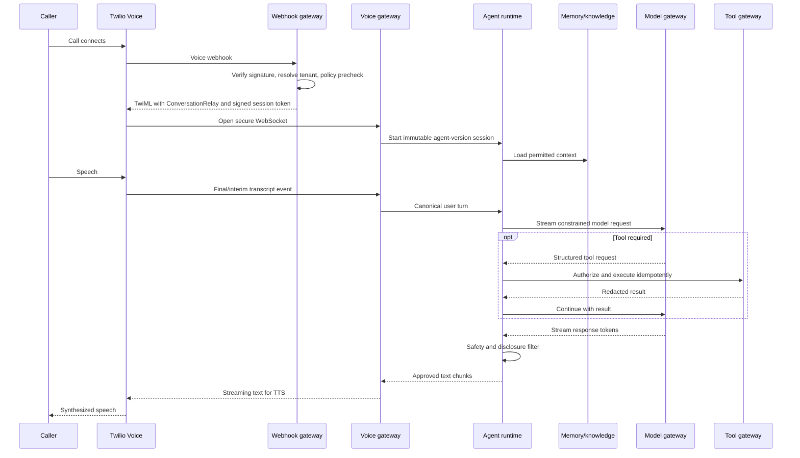

### 8.2 Voice session lifecycle

1. The Twilio voice webhook reaches a dedicated public endpoint.
2. The gateway validates the Twilio request signature against the exact public URL and raw parameters, resolves the tenant from account/number mapping, creates or finds the canonical call, and evaluates inbound policy.
3. It returns TwiML that optionally plays recording/AI disclosures, starts recording separately when policy permits, and connects ConversationRelay to a `wss://` endpoint.
4. The WebSocket URL contains a short-lived, one-time signed session token, not tenant secrets or mutable agent configuration.
5. The voice gateway atomically consumes the token, checks call identity, loads the published agent snapshot, and stores hot state in Redis with a short TTL.
6. Memory and knowledge retrieval are bounded by tenant, contact, purpose, sensitivity, agent policy, and latency budget.
7. Transcript input is treated as untrusted user content. System policy and tool schemas are separated from it.
8. The model streams text. Output safety checks remove disallowed disclosures, payment data, unsupported claims, and accidental system-prompt leakage before speech.
9. Tool actions pass through deterministic authorization, idempotency, timeout, and optional human approval.
10. Interrupt/barge-in cancels model generation and queued speech. Each turn has a cancellation token.
11. Call end seals the transcript range, creates summary/extraction jobs, updates usage, and schedules any approved follow-up.

### 8.3 Latency budget and performance targets

Target **p95 first audible response below 2.0 seconds** after the caller finishes speaking, with a stretch goal of 1.2–1.5 seconds. Track separately:

- Twilio/STT finalization.
- Network transit to the selected Twilio edge and VoiceNexus region.
- Context retrieval.
- Model time to first token.
- Safety-buffer delay.
- TTS start.

Keep the synchronous path free of CRM writes, analytics exports, full transcript persistence, memory extraction, or billing aggregation. Cache immutable agent snapshots and small contact context. Stream short semantic chunks rather than waiting for a complete answer.

### 8.4 Reliability and fallback

- Configure a ConversationRelay `<Connect>` action/fallback path. WebSocket loss should route to a deterministic IVR, voicemail, callback offer, or human queue rather than simply ending the customer experience.
- ConversationRelay does not auto-reconnect; a dropped WebSocket terminates that connection path. Persist enough state to summarize and recover operationally, but do not promise seamless voice reconnection.
- Use model timeouts with a short filler phrase only when truthful, then retry or switch provider. After a bounded delay, use a safe scripted response or hand off.
- Circuit-break model, CRM, and tool providers independently.
- Use bulkheads so one tenant, campaign, language, or slow integration cannot exhaust voice capacity.
- Reserve capacity for inbound and handoff traffic; outbound campaigns must yield under pressure.
- The voice gateway drains connections gracefully during deploys and maintains a connection-count-based autoscaling policy.

### 8.5 ConversationRelay versus Media Streams

Use ConversationRelay by default for managed speech-to-text/text-to-speech and a text WebSocket protocol. Use Media Streams only for a separately configured agent version that requires raw audio, a custom STT/TTS stack, audio transforms, or specialized diarization. They are mutually exclusive on a call. Recording is a separate TwiML action and must obey consent and payment redaction rules.

### 8.6 AI safety controls

- Published agent policy defines allowed topics, forbidden claims, disclosure text, maximum autonomy, tool scopes, and escalation triggers.
- Model input has explicit trust zones: system policy, verified business context, retrieved knowledge, verified customer facts, inferred memories, and user utterance.
- Retrieval content is treated as untrusted and is never allowed to override system or tool policy.
- High-risk tools use step-up confirmation or human approval.
- The model never receives provider credentials, raw payment credentials, full authentication secrets, or unrestricted database access.
- Redact secrets, card data, government IDs, health data, and other configured categories before logs and general-purpose model calls.
- Run pre-release evaluation suites and sampled post-release quality checks per agent version.
- Store the exact configuration versions and model route used for reproducibility.

## 9. Twilio and telephony architecture

### 9.1 Account and number isolation

Recommended modes:

| Tenant tier | Twilio arrangement | Use |
|---|---|---|
| Trial/sandbox | VoiceNexus pooled non-production subaccount | Strict quotas; no production campaigns |
| Standard production | Managed Twilio subaccount per tenant | Isolates numbers, usage, credentials, reputation, callbacks |
| Enterprise | Dedicated managed subaccount or bring-your-own Twilio account | Contractual ownership and dedicated routing |
| Regulated workload | Dedicated account/subaccount boundary | PCI/HIPAA/data-policy isolation as required |

Twilio Conversation Memory has account/store constraints and must be provisioned per tenant/subaccount if enabled. VoiceNexus first-party memory avoids coupling the product's tenancy model to those limits.

### 9.2 Credential model

- Use restricted API keys where supported; avoid using the master Auth Token in application runtime.
- Store credentials in the cloud secret manager and reference them by opaque `secret_ref`.
- Separate credentials by environment and tenant account.
- Rotate keys with overlapping versions and record last successful use.
- Never expose credentials to browsers, prompts, logs, analytics, or customer webhooks.

### 9.3 Webhook ingress pattern

1. Receive through WAF/load balancer with the original host/protocol preserved.
2. Read the raw request and validate the Twilio signature before parsing or tenant actions.
3. Resolve tenant by Account SID plus endpoint/number mapping; never trust a request-supplied `tenant_id`.
4. Reject unknown accounts, destinations, stale replay tokens, and malformed payloads.
5. Persist a minimal inbox row and encrypted raw payload reference.
6. Respond quickly; publish normalized processing asynchronously.
7. Deduplicate by stable provider SID plus event kind/status and guard legal state transitions.
8. Correlate call/message/conversation IDs and trace IDs.

Status callbacks are not ordered guarantees. A delayed `sent` callback must not move a message backward from `delivered`, and duplicate call completion events must not create multiple follow-ups or usage charges.

### 9.4 Outbound calling controls

- A compliance gate checks consent purpose, DNC/suppression, recipient local time, jurisdiction, campaign frequency, prior attempts, caller ID eligibility, tenant quota, and budget.
- The scheduler resolves recipient timezone conservatively; ambiguous destinations use tenant policy or are held for review.
- Rate limits exist per tenant, Twilio account, phone number, destination prefix, campaign, and global platform.
- Register and monitor caller identity/trust programs and number reputation. Use owned numbers to maximize attestation where available.
- Answering-machine detection may classify outcomes but must not cause unsafe disclosure to voicemail.
- Retry policies depend on outcome. `busy`, temporary failure, voicemail, no answer, explicit rejection, and opt-out are not equivalent.
- Campaign pacing accounts for human-agent capacity when calls may transfer.

### 9.5 Inbound number routing

Resolve the called number to tenant, environment, business hours, agent version, language policy, and fallback. Unknown or disabled mappings receive a safe generic response without revealing tenant information. A tenant can route by number, IVR selection, contact segment, schedule, or CRM status.

### 9.6 Human transfer

For a live voice handoff, the handoff service creates a routing task, selects a queue, supplies a redacted context snapshot, and moves the call into a conference or dials the selected agent. The AI must stop speaking before the human joins. If no agent accepts within the policy window, offer callback, voicemail, or resume only through an explicitly designed supported path; do not assume human-to-AI “boomerang” behavior is provided by Twilio.

## 10. WhatsApp architecture

### 10.1 Channel flow

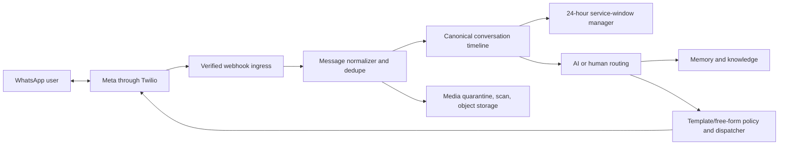

### 10.2 Inbound handling

- Validate provider signature and resolve tenant/sender.
- Deduplicate by provider message ID.
- Normalize sender into a tenant-scoped contact identity; do not merge contacts across tenants.
- Open or extend the 24-hour service window using the authoritative inbound timestamp.
- Quarantine and malware-scan attachments before making them available to humans or models.
- Process opt-out/block signals immediately and update suppression.
- Append to the canonical conversation, then route to AI, workflow, or human inbox based on assignment and operating policy.

### 10.3 Outbound handling

- Within the customer-service window, allow policy-approved free-form content.
- Outside the window, require an approved, correctly categorized and localized template using the provider content/template identifier and validated variables.
- Template version, variables, consent decision, and service-window decision are stored with the message.
- Apply sender throughput and quality-aware rate limits; sustained blocks/reports automatically pause the campaign.
- Track queued, sent, delivered, read, failed, and undelivered states with monotonic state rules.
- Messages approaching provider queue expiry are cancelled or failed explicitly; they are not allowed to arrive out of context hours later.

### 10.4 WhatsApp operational requirements

- Production senders require Meta/Twilio registration and tenant-specific business verification.
- WhatsApp-specific opt-in is required; SMS consent is insufficient.
- Templates need a lifecycle dashboard: draft, submitted, approved, rejected, paused, disabled, superseded.
- Quality rating, sender throughput, template failures, window violations, opt-outs, and block rates are SLO inputs.
- The unified inbox must lock AI and human authorship so they do not respond simultaneously.

## 11. Customer memory architecture

### 11.1 Memory layers

| Layer | Examples | Authority and lifetime |
|---|---|---|
| Identity | phone, WhatsApp identity, CRM ID | Verified sources; long-lived |
| Operational profile | account tier, open ticket, order state | Source system is authoritative; refresh rather than infer |
| Explicit preferences | language, preferred time, channel | User-confirmed; effective-dated |
| Episodic memory | “asked about product X last week” | Conversation-derived with provenance and retention |
| Semantic summary | themes, goals, recent relationship summary | Model-generated; lower authority, periodically regenerated |
| Workflow state | promised callback, pending document | Durable workflow is authoritative |
| Knowledge | policies, catalog, scripts | Tenant-published knowledge, not customer memory |

Never flatten these layers into one prompt blob. Context assembly labels source, age, confidence, sensitivity, and authority.

### 11.2 Identity resolution

The identity graph is tenant-local. Exact verified identities match automatically. Probabilistic matches produce a review candidate and must not silently merge records. Contact merges are reversible through an alias/merge ledger. A phone number may be recycled, shared, or reassigned; sensitive information requires a fresh authentication step rather than caller-ID trust.

### 11.3 Memory write pipeline

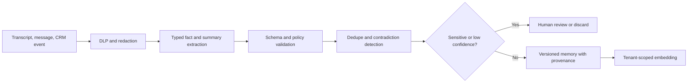

Writes happen after an interaction or explicit confirmed statement; the real-time loop may write only high-value operational promises that must survive immediately. Model-generated memories are marked inferred. Sensitive categories can be disabled entirely by tenant policy.

### 11.4 Memory retrieval pipeline

1. Resolve tenant, contact, active conversation, purpose, and agent version.
2. Apply hard filters for tenant, contact, allowed memory types, consent, sensitivity, valid dates, retention, and access labels.
3. Retrieve recent authoritative facts and a bounded hybrid semantic/lexical set.
4. Rerank by relevance, authority, confidence, freshness, and contradiction state.
5. Fit a strict token budget and label every item with provenance class.
6. Log access to sensitive memory.
7. Exclude content that is stale, contradicted, expired, or unrelated to the current purpose.

### 11.5 Twilio Conversation Memory integration

If enabled, create the Twilio Memory Store before the corresponding Conversation/Orchestrator linkage, and keep tenant mapping explicit. Recall may enrich a session, while VoiceNexus remains authoritative. Mirror only permitted observations, use provider IDs as external references, account for eventual consistency, and monitor silent linkage failures. Do not depend on cross-channel stitching being automatic; VoiceNexus passes and maintains the canonical conversation identity.

### 11.6 Deletion and correction

A verified data-subject request fans out to PostgreSQL, vectors, object storage, analytics, caches, backups by expiry, CRM mirrors, and provider APIs where supported. Corrections create a new effective-dated fact and invalidate the old one. Deleted memory is not recoverable through application paths; a non-content tombstone may prevent accidental resurrection from later syncs.

## 12. Multi-tenant SaaS architecture

### 12.1 Isolation model

Default tenants share compute and a PostgreSQL cluster, with defense in depth:

- `tenant_id` on every tenant-owned row.
- PostgreSQL row-level security enforced using trusted request/session context.
- Repository methods derive tenant context from authentication, never from a client-provided filter alone.
- Compound unique keys include tenant scope.
- Cache keys, object paths, vector filters, event envelopes, metrics, and search indexes include tenant ID.
- Background jobs carry signed/validated tenant context and reload authorization before sensitive action.
- Provider accounts, numbers, sender identities, and secrets are mapped to one tenant.
- Cross-tenant administrative access is a separate break-glass role with reason, approval, expiry, and audit.

Enterprise tiers may use a dedicated database, encryption key, Twilio account, compute pool, VPC connection, and region. The domain layer and APIs remain identical.

### 12.2 Noisy-neighbor controls

- Per-tenant concurrency, calls-per-second, messages-per-second, tokens-per-minute, tool-call, storage, and export limits.
- Weighted fair queues with reserved inbound/handoff capacity.
- Campaign budgets and daily caps.
- Model and provider circuit breakers scoped per tenant.
- Query timeouts, export queues, and analytics isolation.
- Automatic suspension of abusive or anomalous traffic without impacting other tenants.

### 12.3 Tenant lifecycle

Provisioning creates tenant data, owner membership, plan/entitlements, encryption context, provider connection mode, webhook routes, default roles, retention policy, and audit stream. Production traffic remains disabled until required number/sender registration, consent configuration, test calls, webhook validation, and billing checks pass.

Suspension blocks new outbound traffic while preserving inbound safety behavior and access for export/payment resolution. Deletion is a workflow with cooling-off period, legal-hold check, provider teardown, data erasure, and auditable completion.

## 13. Roles and permissions

### 13.1 Authorization model

Use RBAC for understandable tenant roles and ABAC for context-sensitive restrictions. A permission is `resource:action` with optional scope and conditions. Examples include `calls:initiate`, `recordings:play`, `agents:publish`, `contacts:export`, and `billing:manage`.

Scopes are tenant, team, queue, campaign, assigned-record, or own-record. Conditions may include channel, jurisdiction, data sensitivity, operating hours, and required approval. Deny overrides allow. Publication, export, secret management, retention changes, and bulk campaigns require recent authentication and may require dual approval.

### 13.2 Default roles

| Role | Intended permissions |
|---|---|
| Owner | Full tenant governance; ownership transfer; break-glass approval |
| Tenant admin | Users, roles, integrations, configuration; no ownership transfer by default |
| Billing admin | Plan, invoices, usage, billing contacts; no conversation content |
| Developer | API keys, webhooks, integrations, sandbox; no production export by default |
| AI designer | Draft agents, prompts, tools, knowledge, evaluations |
| AI publisher | Approve and publish tested agent versions; separate from author when required |
| Campaign manager | Segments, campaigns, schedules, templates within policy |
| Supervisor | Queues, live monitoring, assignments, escalations, quality review |
| Human agent | Assigned conversations, permitted contact context, dispositions |
| Analyst | Aggregated analytics and redacted interaction review |
| Compliance officer | Consent, suppression, retention, audit, deletion, recording policy |
| Read-only auditor | Time-limited read access to approved records and audit trails |

### 13.3 Sensitive actions

The following require stronger controls: listening to recordings, viewing unredacted transcripts, exporting contacts, publishing agents, launching bulk outbound campaigns, altering suppression, changing retention, decrypting provider credentials, impersonating a tenant user, and deleting data. Record purpose and reason for every sensitive access.

## 14. API architecture and endpoint list

### 14.1 API conventions

- REST under `/v1`; use cursor pagination and UTC timestamps.
- Idempotency keys are required for create/send/call/launch/tool-effect operations.
- Optimistic concurrency uses entity version/ETag for mutable configuration.
- API errors use stable machine codes, human-safe messages, correlation IDs, and field details.
- Long operations return an operation resource.
- Public schemas are versioned; breaking changes create a new API or event version.
- Tenant is derived from the access token/host context, not accepted as an arbitrary body field.
- Webhooks use separate provider endpoints and verification, not customer API authentication.

### 14.2 Authentication and tenant APIs

- `POST /v1/auth/login`
- `POST /v1/auth/refresh`
- `POST /v1/auth/logout`
- `POST /v1/auth/mfa/challenge`
- `GET /v1/me`
- `GET/PATCH /v1/tenant`
- `GET/POST /v1/tenant/members`
- `PATCH/DELETE /v1/tenant/members/{memberId}`
- `GET/POST /v1/roles`
- `GET/PATCH/DELETE /v1/roles/{roleId}`
- `GET/POST /v1/service-accounts`
- `POST /v1/service-accounts/{id}/keys`
- `DELETE /v1/service-accounts/{id}/keys/{keyId}`
- `GET /v1/audit-logs`

### 14.3 Contact, lead, consent, and segment APIs

- `GET/POST /v1/contacts`
- `GET/PATCH/DELETE /v1/contacts/{contactId}`
- `POST /v1/contacts/imports`
- `POST /v1/contacts/{contactId}/merge`
- `GET/POST /v1/contacts/{contactId}/identities`
- `GET/POST /v1/contacts/{contactId}/consents`
- `POST /v1/contacts/{contactId}/opt-out`
- `GET/POST /v1/leads`
- `GET/PATCH /v1/leads/{leadId}`
- `POST /v1/leads/{leadId}/qualify`
- `GET/POST /v1/segments`
- `POST /v1/segments/{segmentId}/snapshot`
- `GET/POST /v1/suppressions`
- `DELETE /v1/suppressions/{suppressionId}` with compliance permission and audit
- `POST /v1/data-subject-requests`
- `GET /v1/data-subject-requests/{requestId}`

### 14.4 Agent, model, tool, knowledge, and evaluation APIs

- `GET/POST /v1/agents`
- `GET/PATCH /v1/agents/{agentId}`
- `POST /v1/agents/{agentId}/versions`
- `POST /v1/agents/{agentId}/versions/{version}/validate`
- `POST /v1/agents/{agentId}/versions/{version}/publish`
- `POST /v1/agents/{agentId}/versions/{version}/rollback`
- `GET/POST /v1/model-policies`
- `GET/POST /v1/tools`
- `POST /v1/tools/{toolId}/test`
- `GET/POST /v1/knowledge-bases`
- `POST /v1/knowledge-bases/{id}/sources`
- `POST /v1/knowledge-bases/{id}/reindex`
- `POST /v1/knowledge-bases/{id}/search-test`
- `GET/POST /v1/evaluation-suites`
- `POST /v1/evaluation-suites/{id}/runs`
- `GET /v1/evaluation-runs/{runId}`

### 14.5 Channel, call, message, and conversation APIs

- `GET/POST /v1/provider-connections`
- `POST /v1/provider-connections/{id}/verify`
- `GET/POST /v1/channel-endpoints`
- `GET /v1/phone-numbers`
- `GET /v1/whatsapp-senders`
- `GET/POST /v1/message-templates`
- `POST /v1/calls` for an idempotent outbound call request
- `GET /v1/calls/{callId}`
- `POST /v1/calls/{callId}/cancel`
- `POST /v1/calls/{callId}/handoff`
- `GET /v1/calls/{callId}/recordings`
- `POST /v1/messages` for a policy-checked outbound message
- `GET /v1/messages/{messageId}`
- `GET /v1/conversations`
- `GET /v1/conversations/{conversationId}`
- `GET /v1/conversations/{conversationId}/timeline`
- `POST /v1/conversations/{conversationId}/assign`
- `POST /v1/conversations/{conversationId}/close`
- `POST /v1/conversations/{conversationId}/messages`
- `WS /v1/realtime/agent` for presence, assignments, and live messages

### 14.6 Campaign, workflow, handoff, and reporting APIs

- `GET/POST /v1/campaigns`
- `GET/PATCH /v1/campaigns/{campaignId}`
- `POST /v1/campaigns/{campaignId}/versions`
- `POST /v1/campaigns/{campaignId}/launch`
- `POST /v1/campaigns/{campaignId}/pause`
- `POST /v1/campaigns/{campaignId}/resume`
- `POST /v1/campaigns/{campaignId}/cancel`
- `GET /v1/campaigns/{campaignId}/members`
- `GET/POST /v1/workflows`
- `GET /v1/workflow-runs/{runId}`
- `POST /v1/workflow-runs/{runId}/cancel`
- `GET/POST /v1/queues`
- `GET /v1/handoffs`
- `POST /v1/handoffs/{handoffId}/accept`
- `POST /v1/handoffs/{handoffId}/complete`
- `GET /v1/reports/overview`
- `GET /v1/reports/calls`
- `GET /v1/reports/messages`
- `GET /v1/reports/campaigns/{campaignId}`
- `GET /v1/reports/ai-quality`
- `GET /v1/usage`
- `POST /v1/exports`
- `GET /v1/operations/{operationId}`

### 14.7 Provider and customer webhook APIs

Provider endpoints are public but signature-protected:

- `POST /webhooks/twilio/voice/inbound`
- `POST /webhooks/twilio/voice/status`
- `POST /webhooks/twilio/voice/connect-action`
- `POST /webhooks/twilio/voice/recording-status`
- `POST /webhooks/twilio/messaging/inbound`
- `POST /webhooks/twilio/messaging/status`
- `POST /webhooks/twilio/taskrouter/events` if TaskRouter is used
- `POST /webhooks/twilio/intelligence/events` if Conversation Intelligence is used

Customer outbound webhooks include signed, versioned events such as conversation started/closed, call completed, message received/delivered/failed, lead qualified, handoff requested/completed, appointment booked, and campaign completed. Delivery uses exponential backoff, dead-lettering, replay, and secret rotation.

## 15. Event architecture

### 15.1 Event envelope

Every event has an immutable event ID, event type and schema version, tenant ID, aggregate type/ID/version, occurrence time, producer, trace ID, correlation ID, causation ID, idempotency key, sensitivity classification, and payload or payload reference. Large/sensitive artifacts remain in object storage behind authorized references.

Use the transactional outbox for domain changes and an inbox/processed-event ledger for consumers. Events are facts in past tense; commands are requests that may be rejected.

### 15.2 Core event catalog

- `call.requested`, `call.policy_approved`, `call.queued`, `call.ringing`, `call.answered`, `call.completed`, `call.failed`
- `voice.session_started`, `voice.turn_completed`, `voice.session_interrupted`, `voice.session_failed`
- `recording.available`, `transcript.finalized`, `conversation.summarized`
- `message.received`, `message.queued`, `message.sent`, `message.delivered`, `message.read`, `message.failed`
- `conversation.started`, `conversation.assigned`, `conversation.closed`
- `lead.qualification_started`, `lead.qualified`, `lead.disqualified`, `lead.review_required`
- `follow_up.scheduled`, `follow_up.due`, `follow_up.sent`, `follow_up.cancelled`
- `handoff.requested`, `handoff.queued`, `handoff.accepted`, `handoff.failed`, `handoff.completed`
- `memory.extraction_requested`, `memory.updated`, `memory.contradiction_detected`
- `consent.granted`, `consent.revoked`, `suppression.created`
- `usage.recorded`, `quota.threshold_reached`, `campaign.paused`

## 16. Required event flows

### 16.1 Outbound calls

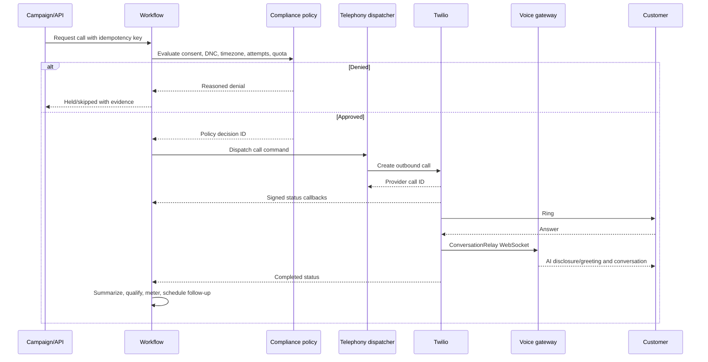

Critical behavior: the workflow owns attempt state, not callback arrival order. A provider request timeout is “unknown” until reconciled by idempotency/provider lookup; do not blindly place a second call.

### 16.2 Inbound calls

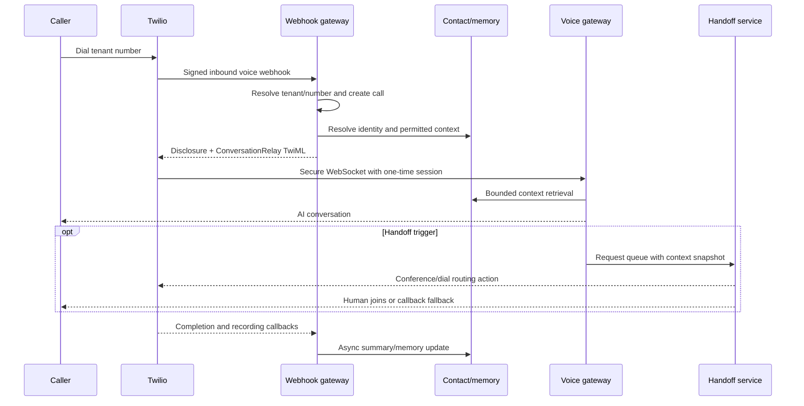

### 16.3 WhatsApp messages

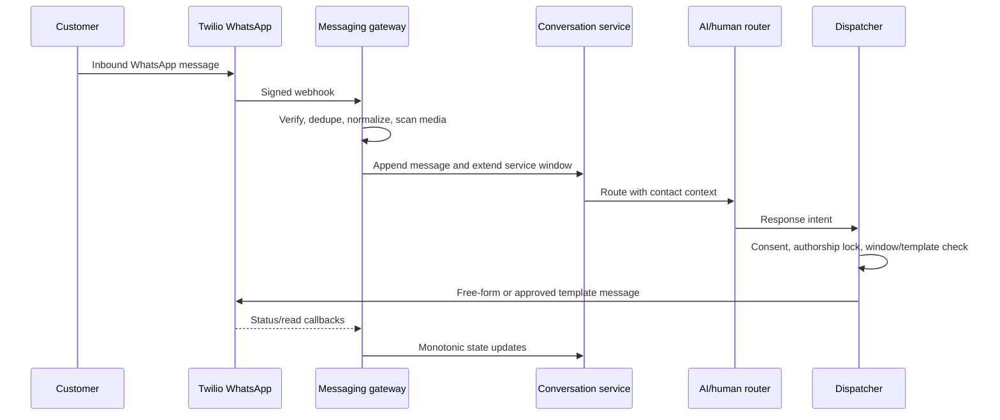

### 16.4 Lead qualification

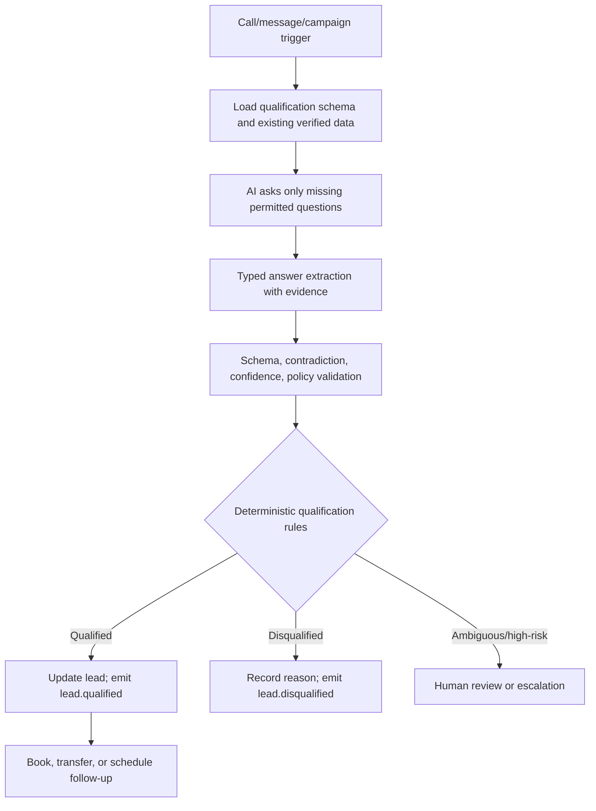

The LLM extracts and converses; deterministic tenant rules calculate the official score/outcome. Every qualification field stores source turn, confidence, and verification state.

### 16.5 Follow-ups

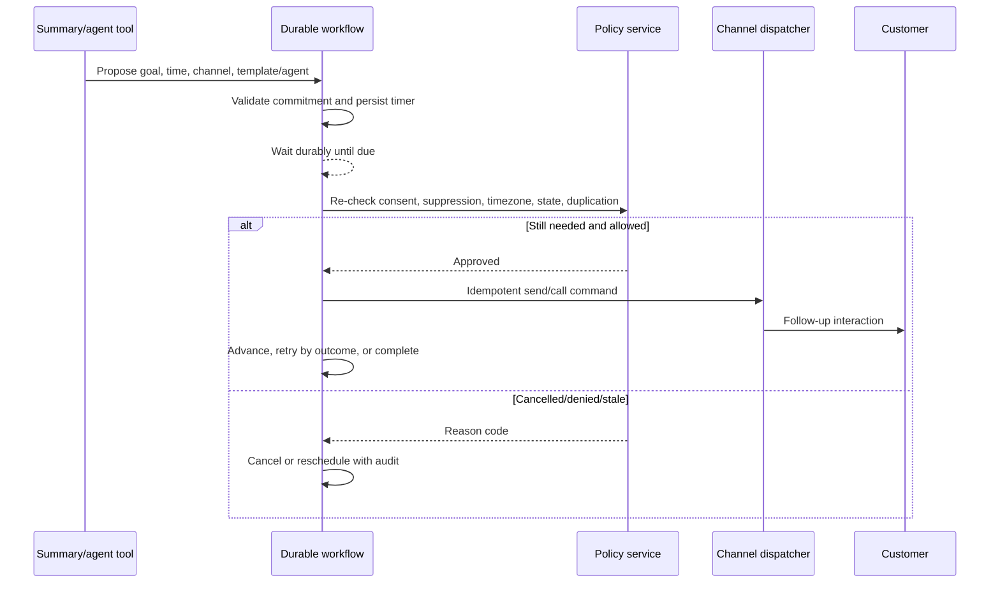

Never rely on a delayed queue message alone for long timers. Durable workflow state must survive deploys and outages, and policy is re-evaluated at execution time.

### 16.6 Human handoff

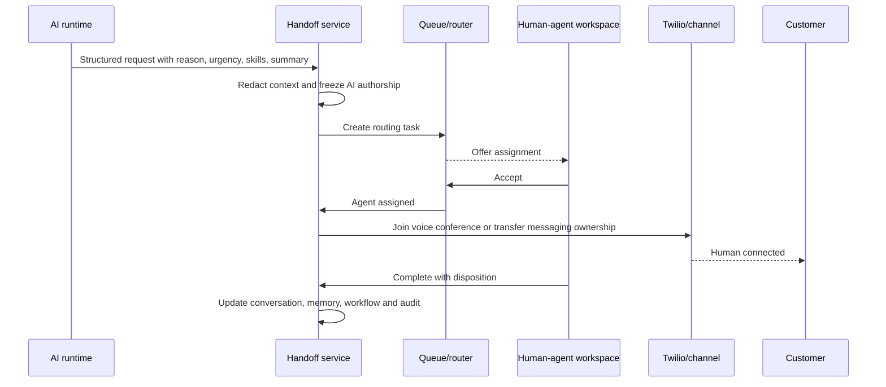

Triggers include explicit customer request, low confidence, repeated failure, sensitive topic, policy rule, negative sentiment with risk, tool failure, or supervisor intervention. If no human is available, the fallback is explicit and channel-appropriate.

## 17. Deployment architecture

### 17.1 Initial AWS production topology

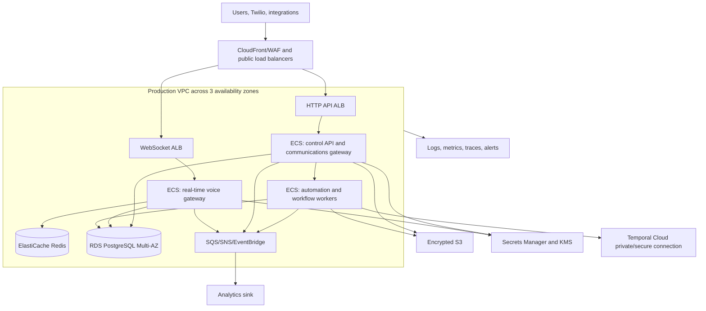

Use separate cloud accounts and Twilio account trees for development, staging, and production. Production services run in private subnets; only load balancers are public. Use egress controls and private endpoints where practical.

### 17.2 Availability and disaster recovery

Launch target:

- Three availability zones.
- RDS Multi-AZ with point-in-time recovery.
- Redis replication with automatic failover; losing Redis degrades active sessions but not durable records.
- Multiple voice and API tasks across zones.
- Queue redrive and dead-letter policies.
- Object versioning and cross-account backup.
- Infrastructure reproducible from code.

Initial objectives: API RTO under 60 minutes, RPO under 5 minutes; durable workflow RTO under 30 minutes; active voice sessions may be lost during a regional event. After product-market fit, run voice gateways active-active near Twilio edges, keep tenant home-region writes, replicate configuration/read models, and provide DNS/provider routing failover. Multi-region database writes should be introduced only with explicit conflict semantics.

### 17.3 CI/CD and release safety

- Trunk-based development with short-lived branches and mandatory review for security/data migrations.
- Build signed immutable container images with software bill of materials and vulnerability scans.
- Apply database migrations as backward-compatible expand/migrate/contract changes.
- Use canary or blue/green deployment for gateways; drain WebSockets before task termination.
- Run contract tests against provider simulators and staging provider accounts.
- Gate agent publication separately from application deployment.
- Feature flags are tenant-aware and have owners/expiry dates.
- Production changes emit audit records and support rapid rollback.

### 17.4 Observability and SLOs

Correlate platform request ID, trace ID, tenant ID, conversation ID, call/message ID, provider SID, AI session ID, workflow run ID, and model request ID. Do not put raw PII/transcripts into ordinary logs.

Suggested launch SLOs:

| Capability | SLO |
|---|---|
| Control API availability | 99.9% monthly |
| Provider webhook durable acceptance | 99.99% monthly |
| Voice gateway connection acceptance | 99.95% monthly |
| Voice response p95 | under 2.0 seconds after end of speech |
| Message dispatch decision p95 | under 2 seconds excluding provider delivery |
| Follow-up execution | 99.9% within configured scheduling tolerance |
| No cross-tenant data exposure | absolute security objective; incident on any violation |

Alert on signature failures, webhook backlog/age, WebSocket disconnect rate, model timeout/fallback rate, response latency, queue depth, callback reconciliation gaps, provider error codes, WhatsApp quality, call answer rate anomalies, transfer failures, consent denials, spend velocity, token cost, tenant quota, memory extraction failures, and RLS/security audit anomalies.

## 18. Security and compliance requirements

### 18.1 Core security controls

- OIDC authentication, MFA for privileged roles, secure session rotation, enterprise SAML/SCIM later.
- Least-privilege IAM for every workload and separate service accounts per environment.
- TLS externally and internally where supported; encryption at rest with managed KMS, optional tenant keys.
- WAF, rate limiting, bot/abuse controls, and DDoS protection.
- Twilio signature verification and replay/idempotency protection on every webhook.
- Short-lived one-time voice session tokens; never expose tenant/provider credentials in WebSocket URLs.
- PostgreSQL RLS plus application tenant checks and automated isolation tests.
- Secret manager, rotation, no secrets in prompts/logs/client bundles.
- DLP/redaction before logs, analytics, model calls, and customer webhooks.
- Attachment quarantine, content-type verification, malware scanning, and signed download URLs.
- Immutable audit export, privileged-access monitoring, and break-glass procedure.
- Dependency/SBOM scanning, SAST, DAST, container scanning, infrastructure policy checks, and regular penetration testing.
- Backups, restore tests, incident response runbooks, provider outage runbooks, and security notification process.

### 18.2 AI-specific threats

- Prompt injection through speech, messages, CRM text, documents, and tool results.
- Retrieval poisoning and malicious knowledge documents.
- Tool abuse and confused-deputy actions.
- System prompt, credential, or cross-contact disclosure.
- Memory poisoning, stale facts, and false identity merge.
- Unsafe autonomous promises or transactions.
- Model-provider data retention and training-policy mismatch.
- Denial-of-wallet through long calls, loops, or tool/model amplification.

Mitigations are structured trust zones, strict tool schemas, allowlists, purpose-limited credentials, deterministic policy, output filters, budgets, turn/time caps, anomaly detection, confirmation, human approval, provenance-aware memory, and continuous evaluation.

### 18.3 Communications compliance baseline

Before outbound traffic, enforce the applicable rules for the tenant and destination. At minimum account for:

- Automated/AI voice consent and required identity/AI/recording disclosures.
- Recipient-local quiet hours and internal/national do-not-call obligations.
- WhatsApp-specific opt-in and template/service-window rules.
- Immediate opt-out and suppression propagation.
- Call-attempt/frequency limits by use case and jurisdiction.
- SHAKEN/STIR/number reputation and sender registrations.
- GDPR/other privacy bases, access, correction, deletion, minimization, residency, and processor agreements.
- HIPAA BAA, encryption, minimum-necessary disclosure, and strict access if PHI is supported.
- PCI isolation: use a provider payment flow such as Twilio Pay; never send card data through the LLM, transcript, recording, memory, or normal logs. Treat irreversible provider PCI settings as a separate account design decision.
- Country-specific regimes such as India TRAI/DLT; US/EU rules cannot be assumed globally.

Legal and compliance counsel must validate policies before launch in each jurisdiction. The application—not Twilio—enforces most business-level consent, quiet-hour, frequency, and retention rules.

### 18.4 Privacy architecture

- Classify data by public, internal, confidential, restricted, and regulated.
- Make recording and transcript capture independently configurable.
- Prefer redacted text and metadata in normal product views.
- Require purpose-bound access to unredacted content.
- Support tenant retention schedules, legal holds, export, deletion, and residency.
- Maintain vendor/subprocessor inventory and model-provider data-processing settings.
- Avoid using customer content to improve shared models unless explicit contractual consent exists.

## 19. Risks, scalability issues, and mitigations

| Risk | Impact | Mitigation/decision |
|---|---|---|
| Voice latency compounds across STT, retrieval, LLM, TTS | Unnatural calls and abandonment | Co-locate regions, stream, strict budgets, cache snapshots, measure every stage |
| ConversationRelay WebSocket drops without reconnect | Abrupt session loss | Redundant gateway, graceful deploy drain, `<Connect>` fallback, scripted IVR/handoff |
| Provider or model outage | Calls/messages fail | Adapter isolation, circuit breakers, secondary models, reconciler, safe fallback |
| Webhooks are duplicated or out of order | Duplicate follow-ups/billing and invalid state | Inbox dedupe, monotonic transitions, idempotent consumers, reconciliation jobs |
| Cross-tenant leakage | Existential security incident | RLS, context-derived tenancy, scoped cache/vector/object keys, isolation tests, audits |
| Compliance varies by destination/use case | Legal and account suspension risk | Versioned policy engine, launch gates, evidence, counsel review, immediate suppression |
| Number/sender reputation degrades | Low delivery/answer rate | Trust registration, warmup, rate/frequency limits, quality monitoring, auto-pause |
| WhatsApp service-window/template mistakes | Silent/non-delivery and quality penalties | Authoritative window state, template validator, status reconciliation |
| LLM hallucination or prompt injection | Harmful claims/actions | Grounding, constrained tools, output checks, confidence/escalation, evaluations |
| Tool side effects repeat | Duplicate booking/order/update | Idempotency keys, effect ledger, confirmation, compensating workflows |
| Memory poisoning/staleness | Wrong personalization or disclosure | Provenance, authority ranking, effective dates, contradiction handling, review |
| Identity based only on caller ID | Sensitive data disclosed to wrong person | Step-up verification for sensitive actions; treat phone identity as weak evidence |
| Campaign bursts overwhelm voice/human agents | Poor quality and outages | Weighted queues, pacing, reserved capacity, agent-capacity feedback, quotas |
| PostgreSQL hot tables/index growth | Slow writes and reports | Partitioning, minimal indexes, read models, archive, analytics offload |
| Vector search crosses scope or slows | Privacy/latency issue | Hard tenant/contact filter before ranking, bounded candidates, dedicated service later |
| Cost runaway from calls/tokens/recordings | Margin loss | Real-time usage ledger, tenant budgets, turn/duration/token caps, anomaly alerts |
| Recording/transcript retention | Privacy and storage exposure | Consent, encryption, short defaults, lifecycle deletion, access logs, legal holds |
| Twilio-native memory/store constraints | Tenant scaling and lock-in | First-party memory authority; optional per-tenant mirror/subaccount |
| Multi-region consistency | Duplicate actions/conflicting ownership | Single home-region writes initially; idempotent global commands; explicit failover |
| Human and AI respond simultaneously | Confusing or unsafe conversation | Conversation authorship lease and explicit handoff state machine |
| Analytics queries affect live calls | Production degradation | Read replicas/warehouse; never query OLTP heavily from dashboards |
| Early microservice sprawl | Slow delivery and unreliable operations | Six deployment units, strict logical boundaries, extract on measured need |

## 20. Capacity and scaling model

Track capacity in concurrent voice sessions, calls started per second, webhook events per second, messages per second per sender, model tokens per minute, active workflows/timers, transcript segments per second, object-storage growth, and human-agent concurrency.

Voice gateway autoscaling should use active WebSockets, event-loop lag, CPU, memory, model-stream backlog, and disconnect/error rate—not CPU alone. Webhook gateways scale on request rate and queue-publish latency. Workers scale on queue depth and oldest-message age. Campaign admission control uses predicted duration and transfer probability, not only start rate.

Indicative evolution:

1. **Up to hundreds of concurrent calls:** shared PostgreSQL, Redis primary/replica, SQS, pgvector, ECS autoscaling.
2. **Low thousands:** separate webhook/voice pools, partition hot tables, read replicas, Redis cluster, analytics store, regional voice pools.
3. **Tens of thousands:** shard tenants by home region/database, dedicated event streaming, per-region voice/session stores, global configuration replication, automated tenant placement.

Scaling thresholds must come from load tests with realistic transcript, model latency, callback fan-out, and recording behavior.

## 21. Development phases

### Phase 0 — Product constraints and foundations

Deliverables:

- Confirm target countries, use cases, languages, call volume, WhatsApp scope, recording, CRM, and human-contact-center strategy.
- Architecture decisions, threat model, data classification, retention baseline, and compliance matrix.
- Monorepo, CI/CD, environment/account isolation, observability foundation, infrastructure modules.
- Canonical API/event schemas, tenant context, outbox/inbox, idempotency standards.

Exit criteria: staging environment is reproducible; provider credentials and webhooks are securely isolated; architecture and compliance assumptions are signed off.

### Phase 1 — Multi-tenant control plane

Deliverables:

- Tenant lifecycle, authentication, MFA, memberships, RBAC, audit.
- Contacts, identities, leads, consent, suppression, imports.
- Provider connections, numbers/senders, secrets references.
- Published agent configuration version model.

Exit criteria: automated tests prove tenant isolation; a tenant can onboard safely without direct database/provider-console edits.

### Phase 2 — Voice MVP

Deliverables:

- Twilio inbound/outbound webhook gateway and status reconciliation.
- ConversationRelay real-time gateway, streaming model adapter, interrupt handling.
- Basic knowledge retrieval, deterministic tool gateway, call timeline.
- Recording disclosure/retention, fallback IVR, usage metering, latency dashboards.

Exit criteria: controlled inbound and one-at-a-time outbound calls pass reliability, safety, latency, duplicate-callback, and failure-fallback tests.

### Phase 3 — Memory, agent lifecycle, and quality

Deliverables:

- Provenance-aware first-party memory and identity resolution.
- Post-call summary/extraction pipeline, contradictions, deletion.
- Agent draft/validate/publish/rollback and evaluation suites.
- Model routing, budgets, fallbacks, redaction, sampled quality review.

Exit criteria: returning contacts receive correct permitted context; deletion and correction work across stores; unsafe evaluation thresholds block publication.

### Phase 4 — WhatsApp and unified inbox

Deliverables:

- Production sender lifecycle, templates, service-window manager.
- Inbound/outbound normalization, media scanning, delivery/read status.
- Human-agent workspace, presence, assignment, authorship lock.
- Cross-channel canonical conversation and context hydration.

Exit criteria: AI and human WhatsApp flows respect opt-in and service windows; duplicate/out-of-order callbacks are harmless.

### Phase 5 — Campaigns, lead qualification, and follow-ups

Deliverables:

- Segment snapshots, campaign versions, pacing, budgets, retry policy.
- Durable workflows for attempts, qualification, booking, and follow-up.
- Deterministic lead scoring with evidence.
- Quiet-hour/timezone/frequency enforcement and automatic campaign pause.

Exit criteria: campaigns cannot bypass policy; pause/cancel is fast; retries and timers survive deploys; no duplicate external effects.

### Phase 6 — Human handoff and integrations

Deliverables:

- Skill queues, handoff contract, context snapshots, voice conference transfer.
- CRM/calendar/ticketing adapters and customer webhooks.
- Supervisor controls, disposition, callback fallback, integration reconciliation.

Exit criteria: failed/unavailable transfers degrade safely; external side effects are idempotent and auditable.

### Phase 7 — Scale, enterprise, and regulated readiness

Deliverables:

- Partitioning, analytics store, regional voice pools, tenant placement.
- SAML/SCIM, dedicated tenant options, private connectivity, customer-managed keys where needed.
- SOC 2 control evidence, penetration test, disaster-recovery exercise, formal incident process.
- Jurisdiction-specific onboarding and regulated workload boundaries.

Exit criteria: load, chaos, restore, regional-failure, security, and compliance tests meet documented SLOs and contractual requirements.

## 22. Testing strategy

- **Unit/domain:** state machines, permission rules, consent precedence, quiet hours, retry outcomes, scoring.
- **Contract:** API/event versions and provider payload mappings using recorded sanitized fixtures.
- **Integration:** PostgreSQL RLS, outbox/inbox, Redis leases, object retention, secrets, workflow replay.
- **End-to-end:** inbound/outbound call, interruption, disconnect fallback, WhatsApp window/template, opt-out, human transfer.
- **Load:** concurrent WebSockets, burst callbacks, campaign pacing, queue recovery, transcript write volume.
- **Chaos:** model timeout, Twilio callback delay, Redis failover, worker restart, network partition, duplicate events.
- **Security:** cross-tenant fuzzing, webhook forgery/replay, IDOR, prompt/tool injection, malicious documents/media, export controls.
- **AI evaluation:** task completion, factual grounding, policy adherence, tool correctness, handoff quality, latency, cost, multilingual performance.
- **Compliance:** evidence capture, DNC/suppression precedence, timezones, retention, legal hold, deletion, recording consent.

No agent version reaches production solely because it “sounds good” in manual testing. It must pass quantitative evaluation thresholds and a canary rollout.

## 23. Key architecture decisions to record as ADRs

1. VoiceNexus first-party memory is authoritative; Twilio memory is optional.
2. ConversationRelay is the default voice transport; Media Streams is separate.
3. PostgreSQL with RLS is the default tenant store; enterprise isolation is a placement option.
4. Managed Twilio subaccount per production tenant, with BYOC enterprise option.
5. Temporal owns long-running timers and follow-up state.
6. Transactional outbox/inbox and at-least-once idempotent processing.
7. Six initial deployment units with logical service boundaries.
8. Deterministic policy and tool authorization outside the LLM.
9. Provider-neutral canonical call/message/conversation models.
10. Single home-region writes initially; regional voice gateways evolve independently.

## 24. Open product decisions before implementation

These do not block the blueprint, but must be answered before Phase 2 production design is frozen:

- Launch countries and whether India traffic is in the first release.
- Initial vertical: sales qualification, support, appointments, collections, or a configurable horizontal platform.
- Required languages, accents, and premium voice expectations.
- Whether call recording is default-off, opt-in, or mandatory for a particular use case.
- Human desktop: VoiceNexus-native, Twilio Flex, or existing contact-center integration.
- CRM/calendar systems required at launch.
- Enterprise BYOC and data-residency commitments.
- Expected concurrent calls, daily messages, contacts per tenant, and number of tenants.
- Whether regulated health, financial, debt-collection, or payment workloads are in scope.
- Billing model: subscription, usage markup, credits, or hybrid.

## 25. Definition of architectural readiness

Implementation may begin when:

- Target market and compliance matrix are approved.
- Tenant, identity, consent, call, message, conversation, and event contracts are reviewed.
- Twilio account/subaccount, number, sender, credential, and webhook ownership are decided.
- Voice fallback and human-handoff behavior are explicit.
- Data classification, retention, recording, model-provider, and deletion policies are explicit.
- SLOs, capacity assumptions, budgets, and alert ownership are assigned.
- Threat model and cross-tenant test plan are approved.
- The Phase 1/2 scope selects which logical services remain grouped in each deployment.

This blueprint intentionally preserves a fast startup path while protecting the decisions that become expensive later: tenant isolation, consent evidence, provider independence, idempotent workflows, memory provenance, human escalation, and real-time voice reliability.
